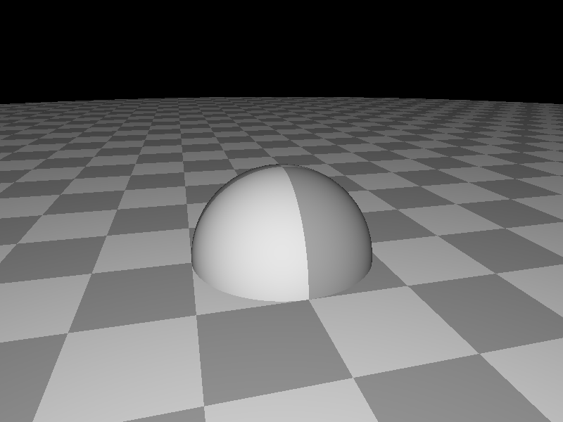

# Rust Path Tracer

A simple naive Path Tracer written in Rust.

Work in progress / features in the future:

- BVH (Bounding Volume Hierarchy)
- Meshes
- Better materials (PBR and more BSDF models)

## Features

- Geometry (Spheres, Planes and Disks)
- Materials (Glass, Mirror, Diffuse)
- Textures
- Depth of field
